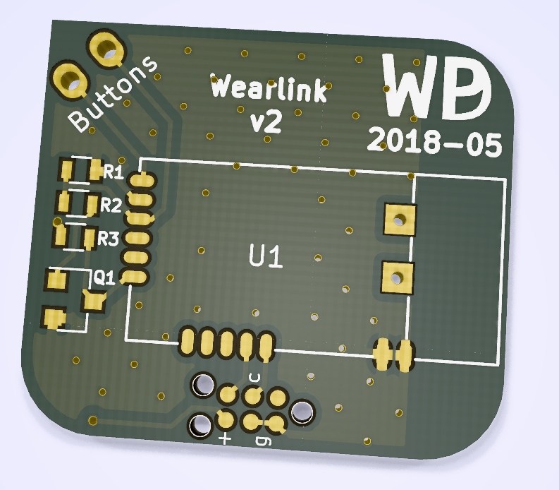

# Wearlink v2

## Introduction

While looking for a new winter coat I stumbled on a Taiwanese manufacturer
selling a black and blue winter coat with keys on the sleeve.

The keys legend betray their intended purpose: volume control, play/pause and
forward/reverse. I listen to podcasts on my android phone in the car and on the
bike, and this would make a great way to control those even when wearing
gloves!

It turns out that the real keypad is glued to the inside of the sleeve, just
under the outer coat layers. A ruggedized two-wire cable connected the keypad
to a 2.5mm TRS in the left chest pocket.

The keypad is manufactured by [FibreTronic](http://fibretronic.com) under the
moniker connectedwear. They sell a range of keypads (my coat has the
[KP2-5SH](http://fibretronic.com/connectedwear/KP25SH) ) and a range of
controllers that can be connected to the keypad. Naturally none of their
controllers work for me. A couple of years I built my
[first controller](https://github.com/dijkstrw/wearlink), and this project is
an update of that design with these requirements:

* No wiring between controller and phone. Making reliable connections between
  flexible wire and hard connectors is a hard problem. I have had to replace
  the connections many times, and have not found a good way to make them last
  years when wires can flex due to walking.

* No wiring means internal battery -- be frugal in power consumption.

* Default interface to the phone. Ideally no programming on the phone, because
  this somewhat guarantees project longevity.

## My design

A controller that pretends to be a usb keyboard and emits multimedia keys for
keypresses. Bluetooth is used to eliminate wires, and the mcu and pcb has been
designed for low power operation to make that battery go for months. I had
heard good things about Nordic, and went with the
[nRF51822](https://www.nordicsemi.com/eng/Products/Bluetooth-low-energy/nRF51822)
because:

* ARM Cortex M0

* Bluetooth Low Energy

* 128k flash at entry level (but read on)

* Onboard regulators, with a supply range between 1.8 and 3.6V

* JTAG programming using a four wire interface

### nRF51822

BLE is implemented using a soft-core that lives in the first half of the
flash. Your application configures the soft-core structures to get the type of
BLE interface you want, and the soft-core will call event-handlers to indicate
radio or hardware events.

The nRF51822 needs an antenna and careful layout. There are also ready made
boards that can be used as complete dropin modules, we use the S4AT here.

### ADC configuration / wakeup

Fibretronics wearlink is a string of push button (no) switches individually in
series with a resistor. When no button is pressed it is open circuit. When one
button is pressed, the resistance corresponding to that key is present between
the two feed wires.

Running the ADC will cause it to sample. Sampling looks like an input impedance
of ~390k, so to spare the battery the ADC needs to run only when BLE is
active. Q1 is used to make nice detectable falling edges at keypress to ensure
wakeup when not in a BLE conversation.

As the battery discharges our ADC input voltage will drop also. This is
compensated for by periodically measuring the battery voltage and taking that
into account when determining keys pressed.

Note that a TagConnect header is used for JTAG.

### BLE bonding

BLE pairing is stored in flash and reused at next bootup. To make the
controller forget all pairings press key combination PLAY, PLAY, PLAY, VOLUME
DOWN, VOLUME DOWN, VOLUME UP, VOLUME UP directly after controller wakeup.

## Directory structure

* `config` - board configuration files that define clock and peripheral
  configuration for the nrf51. Also the place where the linker file lives

* `doc` - pdf repository for used boards and ics

* `nrf51_sdk_10_0_0` - Download the [SDK](https://developer.nordicsemi.com/nRF5_SDK/nRF51_SDK_v10.x.x/nRF51_SDK_10.0.0_dc26b5e.zip) from Nordic and unzip here

* `schematic` - board schematic and pcb in Kicad

## Next time

* Current nRF51 carrier (S4AT) does not have a LXFT, so even more power can be saved
  next time by choosing or designing a board that does.

